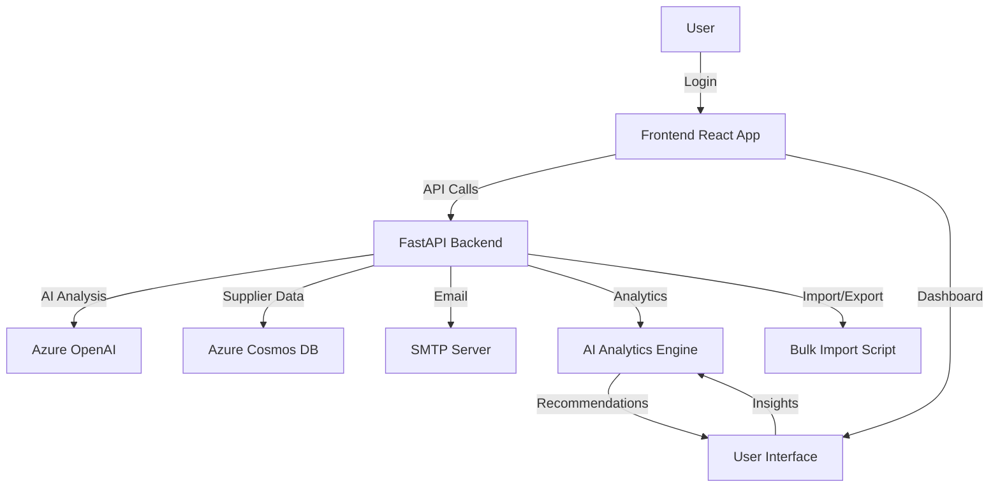
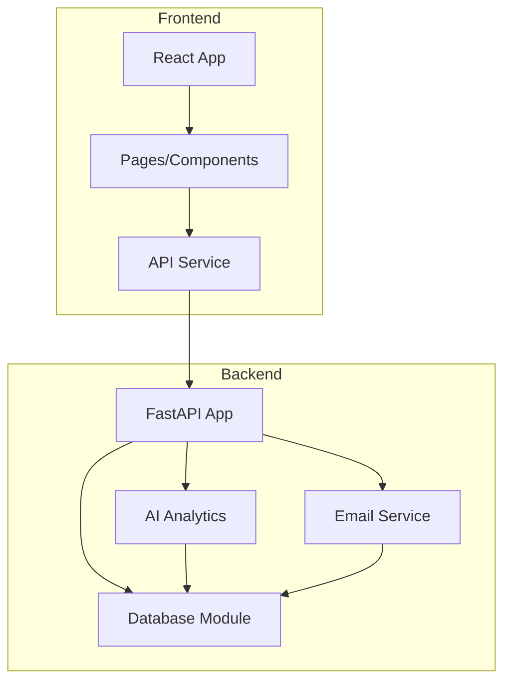
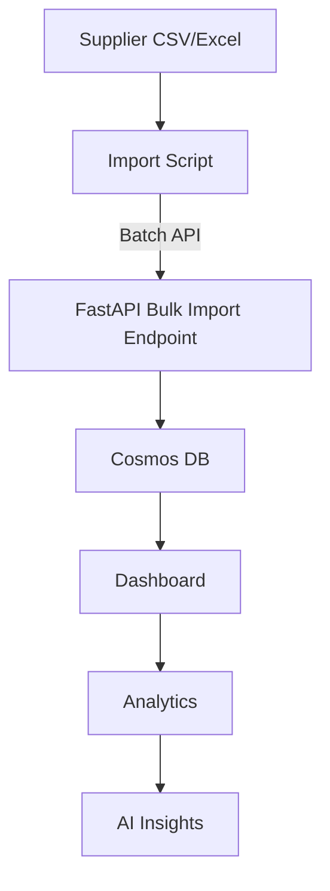
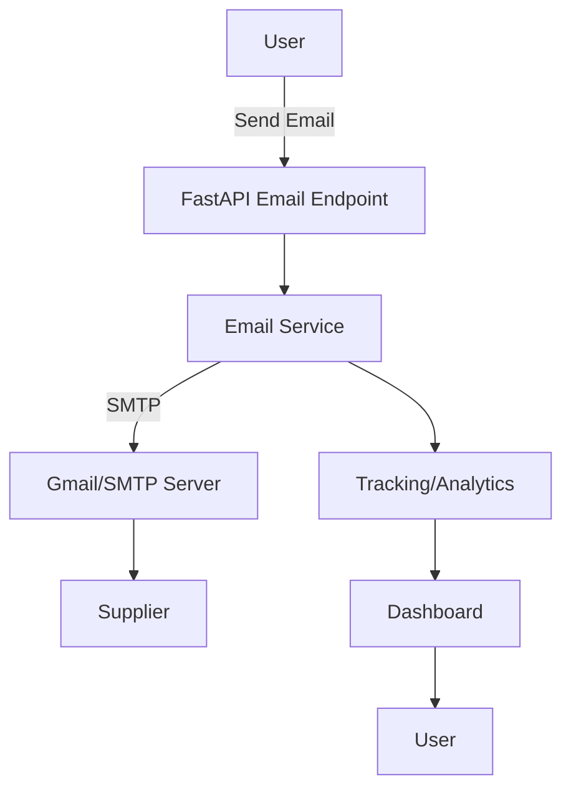
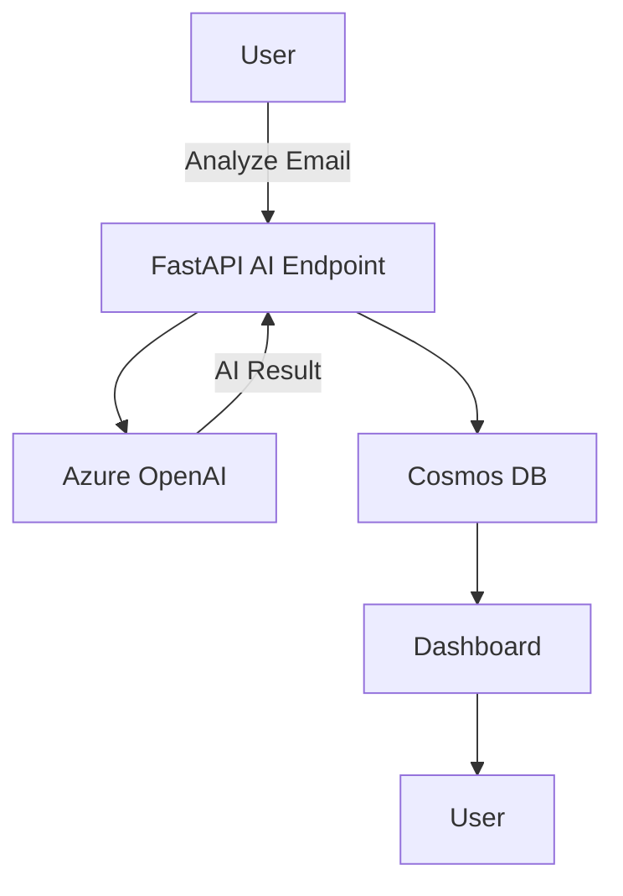
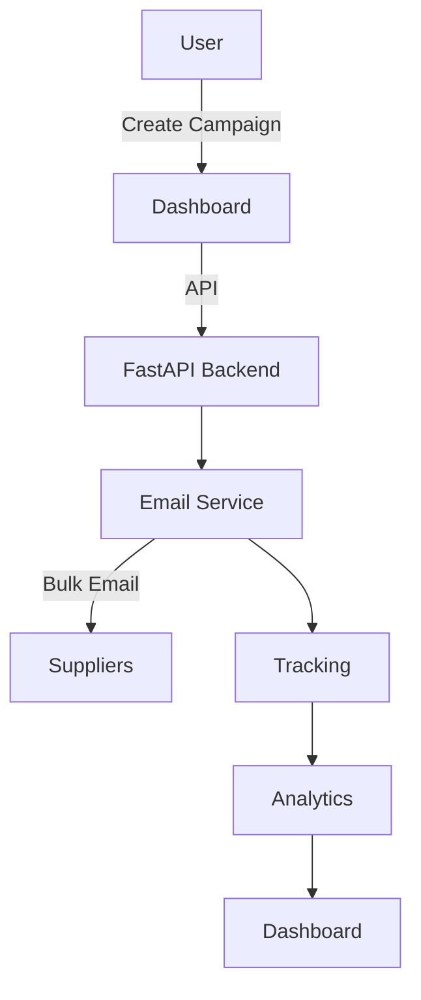

# System Architecture & Workflows

## Overall System Architecture

## Module Relationships

## Supplier Import Workflow

## Email Automation Flow

## AI Email Analysis Flow

## Campaign Workflow
